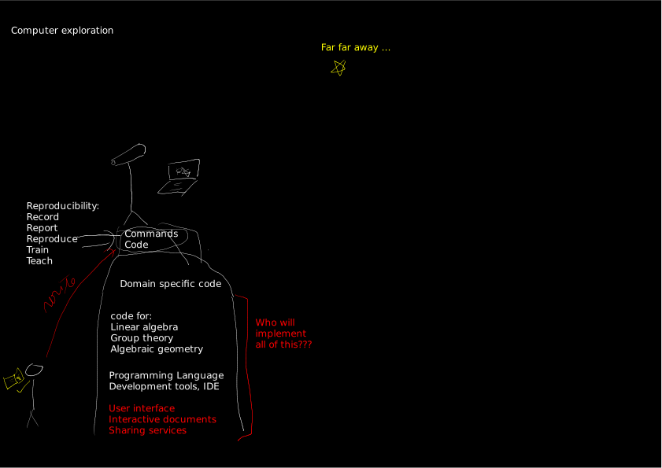

---
jupytext:
  formats: ipynb,md:myst
  notebook_metadata_filter: rise
  text_representation:
    extension: .md
    format_name: myst
    format_version: 0.13
    jupytext_version: 1.10.0
kernelspec:
  display_name: SageMath 9.3.beta5
  language: sage
  name: sagemath
rise:
  auto_select: first
  autolaunch: true
  centered: false
  enable_chalkboard: true
  height: 100%
  margin: 0
  maxScale: 1
  minScale: 1
  scroll: true
  slideNumber: true
  start_slideshow_at: selected
  transition: none
  width: 90%
---

+++ {"slideshow": {"slide_type": "slide"}}

# A glimpse on SageMath in its ecosystem


Sage/Oscar Days for Combinatorial Algebraic Geometry<br>
ICERM, Brown, Wednesday 15th of February 2021

[Nicolas M. Thiéry](http://Nicolas.Thiery.name)<br>
LRI/LISN, Université Paris-Sud/Saclay

<br>
View the (live) slides online:
<a href="https://mybinder.org/v2/gh/nthiery/shared-sage-notebooks/HEAD?filepath=2021-02-15-SageOscarDays.md">
</a>

+++ {"slideshow": {"slide_type": "notes"}}

## Abstract

+++ {"slideshow": {"slide_type": "slide"}}

## What's Sage?

An open-source, community developed, general purpose computational
system for (pure) mathematics.

+++ {"slideshow": {"slide_type": "subslide"}}

### Symbolic computation

```{code-cell} ipython3
---
slideshow:
  slide_type: fragment
---
%display latex
```

```{code-cell} ipython3
---
slideshow:
  slide_type: fragment
---
12/8
```

```{code-cell} ipython3
---
slideshow:
  slide_type: fragment
---
x,y = var('x,y')
solve([x^2+y^2 == 1, y^2 == x^3 + x + 1], x, y)
```

```{code-cell} ipython3
---
slideshow:
  slide_type: fragment
---
f = (cos(pi/4-x)-tan(x)) / (1-sin(pi/4 + x)); f
```

```{code-cell} ipython3
---
slideshow:
  slide_type: fragment
---
limit(f, x = pi/4, dir='minus')
```

```{code-cell} ipython3
---
slideshow:
  slide_type: subslide
---
var('x')
@interact
def g(f=x*sin(1/x), 
      c=slider(-1, 1, .01, default=-.5), 
      n=(1..30),
      xinterval=range_slider(-1, 1, .1, default=(-8,8), label="x-interval"),
      yinterval=range_slider(-1, 1, .1, default=(-3,3), label="y-interval")):
    x0 = c
    degree = n
    xmin,xmax = xinterval
    ymin,ymax = yinterval
    p   = plot(f, xmin, xmax, thickness=4)
    dot = point((x0,f(x=x0)),pointsize=80,rgbcolor=(1,0,0))
    ft = f.taylor(x,x0,degree)
    pt = plot(ft, xmin, xmax, color='red', thickness=2, fill=f)
    show(dot + p + pt, ymin=ymin, ymax=ymax, xmin=xmin, xmax=xmax)
    html(f'$f(x) = {latex(f)}$')
    html(f'$P_{degree}(x) = {latex(ft)}+R_{degree}(x)$')
```

+++ {"slideshow": {"slide_type": "subslide"}}

### Algebraic combinatorics

```{code-cell} ipython3
---
slideshow:
  slide_type: notes
---
L = RootSystem(["A",2,1]).ambient_space()
w1 = [0,1,2,0,2,1,2,1,0,2,0,2,1,2,1,2,0,2,0,1,2,1,0,1]
p = L.plot(alcove_walk=w1, bounding_box=[[-4.5,4.5],[-2.5,6]], fundamental_chamber=False, labels=False)
p
```

```{code-cell} ipython3
---
slideshow:
  slide_type: fragment
---
from sage_combinat_widgets.grid_view_widget import PartitionGridViewWidget
S = SymmetricFunctions(QQ)
s = S.s()
la_input = PartitionGridViewWidget(Partition([2,1]))
mu_input = PartitionGridViewWidget(Partition([2,1]))
@interact
def f(la = la_input, mu = mu_input):
    return s[la] * s[mu]
```

+++ {"slideshow": {"slide_type": "subslide"}}

### And much much more!

+++ {"slideshow": {"slide_type": "subslide"}}

### with a focus on modelling mathematics

```{code-cell} ipython3
---
slideshow:
  slide_type: fragment
---
Suits = Set(["Hearts", "Diamonds", "Spades", "Clubs"])
Values = Set([2, 3, 4, 5, 6, 7, 8, 9, 10, "Jack", "Queen", "King", "Ace"])
Cards = cartesian_product([Values, Suits])
Hands = Subsets(Cards, 5)
Flushes = cartesian_product([Subsets(Values, 5), Suits])
```

```{code-cell} ipython3
---
slideshow:
  slide_type: fragment
---
Flushes.random_element()
```

```{code-cell} ipython3
---
slideshow:
  slide_type: fragment
---
Flushes.cardinality() / Hands.cardinality() * 100.
```

```{code-cell} ipython3
---
slideshow:
  slide_type: subslide
---
%display latex
x = var('x')
p = 54*x^4+36*x^3-102*x^2-72*x-12
for R in [SR, 
          ZZ['x'],
		  QQ['x'], 
		  ComplexField(16)['x'], 
		  QQ[sqrt(2)]['x'],
		  GF(5)['x'],
		  ]:
	display(factor(R(p)))
```

+++ {"slideshow": {"slide_type": "subslide"}}

### thanks to a Rich Type System

```{code-cell} ipython3
---
slideshow:
  slide_type: fragment
---
G = SymmetricGroup(3)
```

```{code-cell} ipython3
---
slideshow:
  slide_type: fragment
---
%display ascii_art
from sage_explorer import explore
explore(G)
```

```{code-cell} ipython3
---
slideshow:
  slide_type: fragment
---
Rings().Division().Finite()
```

+++ {"slideshow": {"slide_type": "slide"}}

### Sage in its ecosystem

+++ {"slideshow": {"slide_type": "subslide"}}



+++ {"slideshow": {"slide_type": "subslide"}}


+++ {"slideshow": {"slide_type": "subslide"}}


+++ {"slideshow": {"slide_type": "subslide"}}


