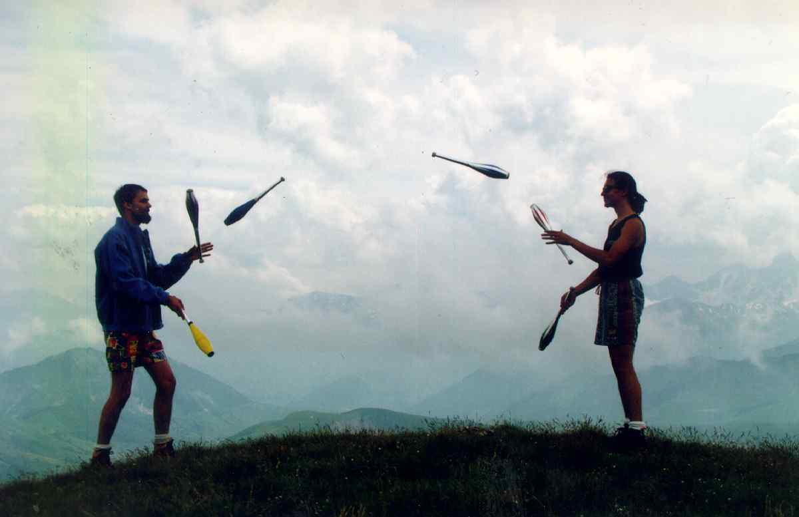

---
jupytext:
  notebook_metadata_filter: rise
  text_representation:
    extension: .md
    format_name: myst
    format_version: 0.13
    jupytext_version: 1.10.3
kernelspec:
  display_name: Python 3
  language: python
  name: python3
rise:
  auto_select: first
  autolaunch: true
  centered: false
  enable_chalkboard: true
  height: 100%
  margin: 0
  maxScale: 1
  minScale: 1
  scroll: true
  slideNumber: true
  start_slideshow_at: selected
  transition: none
  width: 90%
---

+++ {"slideshow": {"slide_type": "slide"}}

# A glimpse at decades of FAIR struggles and practices in computational mathematics

[WoSSS21](https://wosss.org/wosss21/home): The Workshop on Sustainable Software Sustainability 2021
October 10th of 2021

[Nicolas M. Thiéry](http://Nicolas.Thiery.name) 
LRI/LISN, Université Paris-Sud/Saclay

+++ {"slideshow": {"slide_type": "notes"}}

## Executive summary

In the last decades, far before their formalization, Open Science in general and the FAIR principles in particular have been in effect at the core of the development of Free Software for Computational Mathematics. Despite constant challenges and struggles, the situation has been continuously improving, notably through the emergence and propagation of best practices. The recent advances of Open Science, and in particular the recognition of its importance by institutions and policy makers is a major step forward.

**Policy makers: here are some <a href="#messages">messages</a> for you**

+++ {"slideshow": {"slide_type": "subslide"}}

## About me (just to point the origin of my opinions)

- Free Software enthousiast since 1993
- Professor in Algebraic Combinatorics (Math / Computer Science)
- Developper of Free Software for mathematics since 1998  
  SageMath: an open-source, community developed, general purpose computational system for (pure) mathematics.
- Coordinator of EU project OpenDreamKit 2015-2019 8M€

+++ {"slideshow": {"slide_type": "subslide"}}

## An annecdote: Free Software in Science

- 1999: I coorganized a Free Software conference in Lyon
- Invited my dad for a talk about software in science

+++ {"slideshow": {"slide_type": "fragment"}}

- His title: 40 years of Scientific Free Software

+++ {"slideshow": {"slide_type": "fragment"}}

**Lesson learned**: some ideas are in action much before they are conceptualized and recognized

+++ {"slideshow": {"slide_type": "slide"}}

## A brief story on decades of FAIR struggles and practices in computational mathematics

See the the abstract of the talk below.

But really, this talk **is** the abstract of the story ...

+++ {"slideshow": {"slide_type": "fragment"}}

Computing has always been one of the favorite tools in (pure) mathematics to discover and explore new theories. Thus, as computing devices emerged, they were naturally adopted to compute examples, test conjectures or even prove theorem, like the classic four color theorem: computers became the telescope of mathematicians. A telescope made both of general purpose hardware **and** bespoke software. 

At first, it would take advanced skills to develop that software, but the scale was limited: for each project a dedicated program would typically be written by one or two persons. Starting from the 70's with computing capacities and computational mathematics blossoming, the range and the depth of mathematics that could be explored with the computer increased drastically. There was a price however: the software complexity and scale also increased drastically. Rewriting software for each occasion was not sustainable any more; it had to be **Reused**.

Many development models were explored in the 80's and 90's to achieve that aim, with two main archetypes emerging: in the first archetype -- *developed by users for users* -- a mathematical community would get together and build a common system aggregating and structuring the development efforts of the community. Examples of such systems include for example GAP for Group Theory, PARI for Number Theory, Macaulay for Commutative Algebra, etc. Naturally these systems adopted -- when not preceding -- the four principles of Free Software. Indeed computer exploration is by nature a handicraft where the needs are ever changing. Hence the user needs a toolbox that he not only can **reuse as is**, but **observe** with a critical eye, **adapt** to his own
hand and job, with the ability to **redistribute** is adaptations.  A major strength of the for-user-by-user development model is that co-design is at its root, ensuring that the software meets the user's needs and letting the user craft the tool to his own hand.

In the other archetype, the development was carried out by a dedicated team, the obvious challenge being to fund such a team in the long run. Thus, such systems usually ended up taking the commercial route, hence targeting by necessity a wide audience susceptible to draw enough revenue. These systems, including e.g. Maple, MuPAD or Mathematica, had a major impact making computational mathematics more accessible by putting it at the fingertip of casual researchers and teachers. At least when they could afford the licenses.

**Note**: at this point, it should be emphasized that this text is no more than a glimpse into decades of work by hundreds. A proper history should highlight dozens of other systems of all scales and mixed development models that have supported mathematics over the years (just to cite one, since 2018 the Oscar project -- based on Julia -- explores tight integrations between several systems, with a focus on Computer Algebra). In addition mechanizing mathematics goes far beyond computation: formal proofs, data bases, knowledge management, typesetting, etc.

At the turn of the century there was a growing frustration in the community about the situation: through web searches, conferences, or hearsay you would **Find** many functionality that you would dream to use in your own computations, but more often than not they were not **Accessible**, either because they were provided by a system with a license that you could not afford or that would not run on your computer, or by a bespoke system that was not **Interoperable** with yours. To resolve that tension, many were dreaming of a system that would be simultaneously Free Software and general purpose. This was a major technical and social challenge given the very limited resources that the community could devote to such an endeavor. There was hope however thanks to the emergence of:
- adequate general purpose programming language (up to now most systems had developed its own language to serve the needs of mathematical programming)
- a large ecosystem of specialized free mathematical software
- tools and practices enabling large scale collaboration on free software
- a crowd of open source enthousiasts among potential users
Finally, SageMath -- based on Python -- was started in 2005, and progressively a community of hundreds of developers crystalized around that project, proving the sustainability of the by-users-for-users development model if one **reuses** whatever can be to focus the energy on the core of the project. Later steps included tight cooperation with the Jupyter community to outsource in addition the development of the user interface.

To promote **Findability**, the community invested a lot of energy in training workshops, notably dedicated ones for women and minorities, and Question and Answers tools (mailing lists, https://ask.sagemath.org). At a lower scale, interactive use and introspection are powerful tools for discovering features, especially when supported by a strong type system that closely models the business objects, and by tutorials and systematic documentation with many examples. That documentation could still be considerably enhanced with a strong network of cross-links; Natural Language Processing might be able come to the rescue here to automatically generate such a network.

**Accessibility** has been a continuous challenge due to the scale of SageMath, with hundreds of dependencies, some dating from decades: making it easy to install SageMath on personal computers or computing infrastructure required porting to the main operating systems, modularizing, promoting loose coupling between components, and standardizing the build systems to help packaging (Debian, conda, pip, ...) of SageMath itself and users' extensions. These efforts and the integration in the Jupyter ecosystem have considerably reduced the entry barrier for users, in research, teaching and engineering, notably through collaborative virtual environments provided by services such as CoCalc or JuputerHub. This in particular supports **basic reproducibility**, by letting users making their computational narratives accessible to anyone online through on-demand virtual environments (MyBinder.org service).

**Interoperability** is at the core of a system with so many dependencies. The challenge comes from the diversity and richness of objects that one wants to manipulate in mathematics and rich APIs (thousands of types of objects each with dozens of methods). Works occur at the levels:
- Low-level procedure calls and data handles accross components often written in different languages, ideally in shared memory for performance. Favorite tools include Cython, pythran, cppyy, ...  Recent languages like Julia often offer helpful facilities in that regards.
- Adapters to let objects in a used component behave as native objects objects of the calling component.
- Data conversion
On the pragmatic side, adaptation and data conversion can be achieved on a case by  case basis between two systems, though this does not scale well. An ongoing research project is instead to build common ontologies and adapt / convert between any two components through these common ontologies. For that specific aspect, the FAIR challenges for data and software are closely related.

During the talk, I'll use some anectodes to introduce some of the above ideas, summarize some of the best practices in our community, and conclude with messages for policy makers.

+++ {"slideshow": {"slide_type": "slide"}}

## Another annecdote

+++ {"slideshow": {"slide_type": "subslide"}}

## Lessons learned: when FAIR fails

I could not **Find** my best friend's code!

I could not **Access** his code because:
- It was not published
- I did not have a Maple license

Anyway Maple and MuPAD were not **Interoperable**

Thereby, we could not **Reuse** each others code

+++ {"slideshow": {"slide_type": "fragment"}}

**A shame**: we could have saved 50% of development time

+++ {"slideshow": {"slide_type": "fragment"}}

Meaning more research (and more juggling)

+++ {"slideshow": {"slide_type": "subslide"}}

## `*`-Combinat: Sharing Algebraic Combinatorics software since 2000

+++ {"slideshow": {"slide_type": "fragment"}}

Apply induction from two to a community!

+++ {"slideshow": {"slide_type": "fragment"}}

Don't get me started on this

+++ {"slideshow": {"slide_type": "slide"}}

## Some best practices in the SageMath ecosystem

+++ {"slideshow": {"slide_type": "fragment"}}

### Findability

- Organize training and coding sprint workshops  
  Notably dedicated ones for women and minorities
- Run Question&Answers tools (mailing lists, https://ask.sagemath.org)
- Enable interactive use and introspection  
  Powerful tools for discovering features
- Model your business logic and objects  
  Strong type system
- Document: Thematic tutorials and systematic reference manual with many examples
- Enhanced documentation with strong network of cross-links  
  Natural Language Processing to the rescue?

+++ {"slideshow": {"slide_type": "subslide"}}

### Accessibility

- Portability on major Operating Systems
- Modularize, promote loose coupling between components, standardize the build systems
- Help packaging efforts (Debian, **conda**, pip, ...)

Make it easy to install on personal computers or computing infrastructure

+++ {"slideshow": {"slide_type": "fragment"}}

- Support and promote publication of **users' extensions** and users' **computational narratives**
  - **Basic reproducibility**: E.g. through on-demand virtual environments provided by [MyBinder.org](https://mybinder.org)
  - **Long term archival**: [Software Heritage](https://www.softwareheritage.org/)

+++ {"slideshow": {"slide_type": "subslide"}}

## Interoperability

- **Bronze:** enable cross-system procedure calls and handles
- **Silver:** same, using bindings and shared memory for performance  
  Cython, pythran, cppyy, julia facilities, ...
- **Gold:** Enable usage as native objects of the host component through adaptors
- **Diamond:** align type systems through common ontologies to automatically
  generate adaptors and data conversions

Fight silo effects in systems based on hundreds of components!

+++ {"slideshow": {"slide_type": "subslide"}}

### Reusability
- Reuse off-the-shelf components whenever you can
  - Programming languages (e.g. C++, Python, Julia, ...)
  - Preexisting libraries
  - Computing environments and user interfaces (e.g Jupyter)
  - Development models and tools
- Make your software reusable
  - Accessibility, ...
  - Write generic code

Base decisions on technical <em>and</em> social matters

+++ {"slideshow": {"slide_type": "subslide"}}

### Sustainability

- Make your software a good citizen in an ecosystem
- Promote collaborative software development best practices  
  Documentation, tests, continuous integration and release, ...
- Fight technical debt
- Promote ecosystems where:
  - Features **live, compete, and die** when not used anymore  
    But are archived!
  - People and systems **collaborate and strive**

+++ {"slideshow": {"slide_type": "slide"}}

## Messages for policy makers

+++ {"slideshow": {"slide_type": "fragment"}}

- Software raises very specific FAIR challenges; it's not just another type of data
- The FAIR ideas have been around for decades for software
- Given appropriate means and training, scientists are in general sympathetic to Open Science, when not enthusiasts
- Appropriate best practices vary very much from one domain to the other

+++ {"slideshow": {"slide_type": "fragment"}}

Support and foster FAIR practices

  

Don't impose them unless absolutely necessary to counter-balance other higher forces

+++ {"slideshow": {"slide_type": "subslide"}}

- Research software development **by-users-for-users** can work very well  
- However support from **Research Software Engineers** makes a huge difference:
  - training the community base
  - give advice
  - tackle highly technical tasks

+++ {"slideshow": {"slide_type": "fragment"}}

Ease flexible access at all time scales to Research Software Engineers

Promote carreer paths for Research Software Engineers

+++ {"slideshow": {"slide_type": "subslide"}}

Fund basic scientific software development and in particular <em>Software Maintenance</em>

+++ {"slideshow": {"slide_type": "fragment"}}

Project based funding has its limit:
- No predictability
- Tension with career paths
- Huge overhead for the community

+++ {"slideshow": {"slide_type": "fragment"}}

Promote recurrent funding

